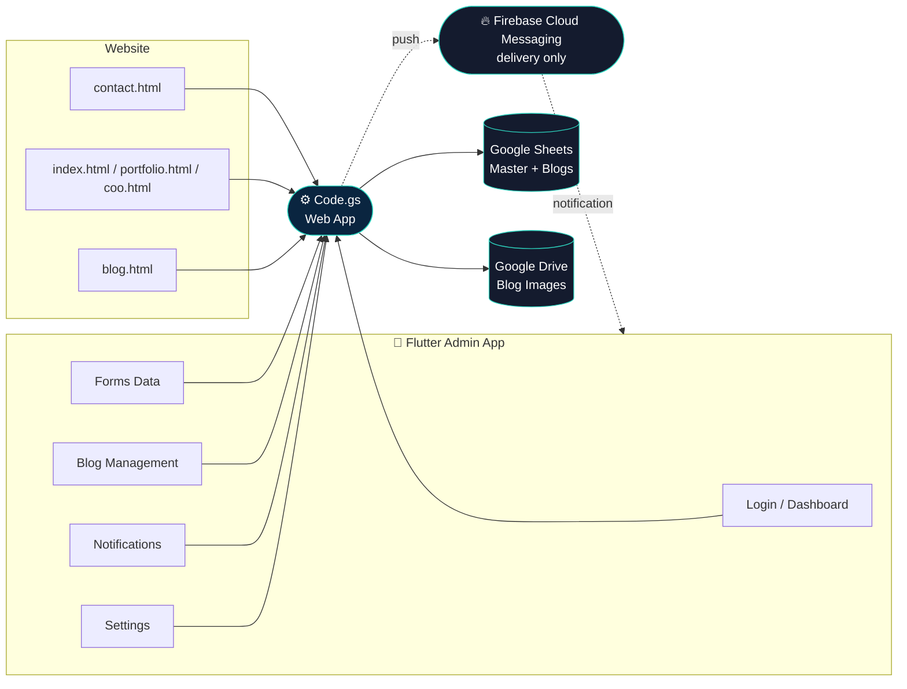

<div align="center">


<a href="https://github.com">
  
</a>

<br/>


</div>

## 📑 Table of Contents

1. [Overview](#-overview)
2. [Full Feature List](#-full-feature-list)
3. [Architecture](#️-architecture)
4. [Google Sheets Schema](#-google-sheets-schema)
5. [Backend API Reference](#-backend-api-reference-codegs) (every endpoint)
6. [Website Pages](#-website-pages)
7. [Mobile App — Every Screen](#-mobile-app--every-screen)
8. [Security](#-security)
9. [Project Structure](#-project-structure)
10. [Complete Setup Guide](#-complete-setup-guide)
11. [Known Limitations & Honest Trade-offs](#-known-limitations--honest-trade-offs)
12. [Tech Stack](#️-tech-stack)

<div align="center"></div>

## 📖 Overview

A complete personal admin system built entirely on **Google Apps Script +
Google Sheets + Google Drive** — deliberately **no traditional server, no
external database**. Three parts, one shared backend:

| Part | Files | Purpose |
|---|---|---|
| 🌐 **Website** | `contact.html`, `index.html`, `portfolio.html`, `coo.html`, `blog.html` | Public-facing site with 4 contact forms and a dynamic blog |
| ⚙️ **Backend** | `Code.gs` | The entire API — auth, contacts, blog CRUD, image upload, notifications, push |
| 📱 **Mobile App** | Flutter project (`personal_admin_app`) | Private admin app — the only place you manage everything from your phone |

The one exception to "no external services": **Firebase is used solely
as a push-notification delivery pipe** so the mobile app can notify you
even when fully closed. No other Firebase product (no Firestore, no Auth,
no Firebase Hosting) is used anywhere — your data, images, and blog
content are 100% Sheets + Drive.

<div align="center"></div>

## ✨ Full Feature List

### Website
- 4 separate contact forms, each auto-routed by a `page` identifier to the correct sheet (Trimitha / Thrinath / Thripura)
- Spam protection: honeypot field, per-client rate limiting, duplicate-submission detection
- Themed error/success popups (toast on 3 pages, modal on the 4th) — never leaks internal error reasons (e.g. "rate limited") to the public
- Dynamic blog engine:
  - Only `Status = Published` posts are ever shown publicly
  - Newest-first, category filter chips, live search, pagination
  - Featured-post spotlight banner
  - Related posts (same category)
  - Views counter, incremented server-side on open
  - Date **and time** shown per post, robust to both real Sheets dates and hand-typed text dates
  - Optional cover image with automatic placeholder fallback if missing/broken
- Dark mode toggle, fully responsive, Tailwind-based design

### Backend (`Code.gs`)
- Single Web App URL serves both the website and the mobile app
- Token-based admin session auth (SHA-256 hashed password, no plaintext ever stored)
- Full contact management: list/search/filter/star/soft-delete, per-sheet
- Full blog management: create/update/delete (soft), publish/draft/archive, image upload to Drive
- Self-healing setup: `setupProject()` creates/repairs the spreadsheet, tabs, headers, and Drive folder — safe to re-run anytime
- Data-integrity guards: slug lookups reject blank cells (prevents accidental empty-string matches), Date columns always stored as real datetimes
- Script-cache layer on the public blog list + comment/like counts (30s TTL, auto-busted on any write) for faster repeat page loads
- CSV export of all contacts and all blogs (used by the mobile app's Settings screen)
- Push notifications sent directly from Apps Script via the FCM HTTP v1 API (hand-rolled OAuth2/JWT signing — no SDK)
- Notification system: unread/read tracking per contact, "mark all read", full history view

### Mobile App (Flutter)
- **Login** — secure token storage (encrypted, not plain SharedPreferences), clear error states
- **Dashboard** — live stat cards (Total/Today's/per-source contacts, Published/Draft blogs, unread notifications), pull-to-refresh, tap-through navigation
- **Forms Data** — Trimitha/Thrinath/Thripura tabs, search, Newest/Oldest/Unread/Starred filters, star/delete/share/copy per card, full Contact Detail view with notes and quick actions (email/copy/share/delete)
- **Blog Management** — stats row (Total/Views/Featured/Drafts), search, sort, cover-image picker with Drive upload, full create/edit form, Preview screen, contextual Publish/Archive/Unarchive actions
- **Notifications** — Unread/All tabs, "Mark All Read", live badge count on the bottom nav, **real push notifications delivered even when the app is fully closed** (Firebase Cloud Messaging)
- **Settings** — live profile header, change password, CSV export (contacts + blogs) via native share sheet, logout
- Dark navy/teal Material 3 theme throughout, Poppins (headings) + Inter (body) typography, custom app icon support via `flutter_launcher_icons`

<div align="center"></div>

## 🏗️ Architecture



<div align="center"></div>

## 🗄️ Google Sheets Schema

### Spreadsheet: `Master`

Sheets **Trimitha**, **Thrinath**, **Thripura** — identical columns, one per website source:

| Column | Type | Notes |
|---|---|---|
| Timestamp | Datetime | Set automatically on submission |
| ContactID | Text | UUID, generated per submission |
| Name | Text | |
| Email | Text | Validated on submit |
| Subject | Text | Defaults to "General Inquiry" |
| Message | Text | |
| Source | Text | The `page` identifier (`contact`/`index`/`portfolio`/`coo`) |
| Status | Text | `Unread` / `Read` / `Deleted` (soft delete) |
| Starred | Boolean | |
| Notes | Text | Private admin notes |

### Spreadsheet: `Blogs`

Sheet **Blogs**:

| Column | Type | Notes |
|---|---|---|
| Timestamp | Datetime | Row creation time |
| BlogID | Text | UUID |
| Title | Text | |
| Category | Text | Freeform |
| Overview | Text | Short excerpt, max 200 chars in the editor |
| Content | Text | Plain text (not HTML/rich text) |
| Status | Text | `Draft` / `Published` / `Archived` |
| Image | Text | Drive-hosted image URL, optional |
| Slug | Text | Auto-generated from title if not provided; **must be unique/non-blank** — lookups explicitly reject blank matches |
| Date | Datetime | Publish date; falls back to Timestamp if blank |
| Author | Text | Defaults to "Admin" |
| Views | Number | Incremented server-side per open |
| Featured | Boolean | Shows the homepage spotlight banner |
| SEOKeywords | Text | Comma-separated |
| MetaDescription | Text | Max 160 chars in the editor |
| Deleted | Boolean | Soft delete flag |

Sheet **DeviceTokens** (push notifications):

| Column | Type | Notes |
|---|---|---|
| Token | Text | FCM device token |
| Platform | Text | `android` / `ios` / `web` |
| RegisteredAt | Datetime | |

<div align="center"></div>

## 🔌 Backend API Reference (`Code.gs`)

All requests go to your one Web App URL (`.../exec`), with `?action=...`
for GET or `{"action": "..."}` in the JSON body for POST. 🔒 = requires a
valid admin `token`.

### GET actions

| Action | Auth | Params | Returns |
|---|---|---|---|
| `blogs` | Public | `page`, `pageSize`, `category`, `search` | Published posts only, paginated |
| `adminBlogs` | 🔒 | `search`, `status` | **Every** status (Draft/Published/Archived) with row numbers |
| `blog` | Public | `slug` | Full post + related posts; increments Views |
| `dashboard` | 🔒 | — | All dashboard stat card values |
| `whoami` | 🔒 | `token` | The logged-in username |
| `forms` | 🔒 | `sheet`, `search`, `status` | Contacts for one sheet |
| `search` | 🔒 | `q` | Cross-sheet contact search |
| `statistics` | 🔒 | — | Submissions by source/by day |
| `notifications` | 🔒 | `all` (`true`/omit) | Unread-only by default, or full history |
| `export` | 🔒 | `type` (`contacts`/`blogs`) | Raw sheet data for CSV export |

### POST actions

| Action | Auth | Body | Purpose |
|---|---|---|---|
| `submitForm` | Public (API key) | `page`, `apiKey`, `name`, `email`, `subject`, `message`, `website` (honeypot) | Contact form submission |
| `login` | Public | `username`, `password` | Returns a session token |
| `changePassword` | 🔒 | `oldPassword`, `newPassword` | |
| `updateContact` | 🔒 | `sheet`, `row`, `status?`, `starred?`, `notes?` | |
| `deleteContact` | 🔒 | `sheet`, `row` | Soft delete |
| `createBlog` | 🔒 | title/category/overview/content/etc | |
| `updateBlog` | 🔒 | `row` + any fields to change | |
| `deleteBlog` | 🔒 | `row` | Soft delete |
| `incrementView` | Public | `slug` | Background view-count bump (fire-and-forget from the app) |
| `uploadImage` | 🔒 | `imageBase64`, `filename`, `mimeType` | Uploads to Drive, returns URL |
| `markNotificationRead` | 🔒 | `sheet`, `row` | |
| `markAllRead` | 🔒 | — | Marks every unread contact as Read |
| `registerDeviceToken` | 🔒 | `token`, `platform` | Registers a device for push |

<div align="center"></div>

## 🌐 Website Pages

| File | Purpose | Saves to |
|---|---|---|
| `contact.html` | Main contact page | `Trimitha` |
| `index.html` | Homepage contact form | `Thrinath` |
| `portfolio.html` | Portfolio contact form | `Thrinath` |
| `coo.html` | COO/founder page contact form | `Thripura` |
| `blog.html` | Public blog — list + article view | Reads only (no form) |

Each of the 4 form pages shares one `API_CONFIG` block (Web App URL + API
key) — edit those two values and every page is connected.

<div align="center"></div>

## 📱 Mobile App — Every Screen

| Screen | File | What it does |
|---|---|---|
| Login | `login_screen.dart` | Username/password, secure token storage |
| Dashboard | `dashboard_screen.dart` | Live stat cards, tap-through to related tab |
| Forms Data | `forms_data_screen.dart` | 3-sheet tabs, search, 4 filters, contact cards |
| Contact Detail | `contact_detail_screen.dart` | Full submission view, notes, quick actions, auto-marks Read |
| Blog Management | `blog_management_screen.dart` | Stats row, search, sort, blog cards with status actions |
| Blog Editor | `blog_editor_screen.dart` | Create/edit form, cover image upload, Save Draft / Publish |
| Blog Preview | `blog_preview_screen.dart` | Read-only view of a post |
| Notifications | `notifications_screen.dart` | Unread/All tabs, mark-all-read, opens Contact Detail |
| Settings | `settings_screen.dart` | Profile, change password, CSV export, logout |
| App Shell | `app_shell.dart` | Bottom nav (5 tabs), live notification badge |

Supporting services:

| File | Purpose |
|---|---|
| `api_service.dart` | The only place that knows your Web App URL; every screen calls through here |
| `notification_service.dart` | Foreground/recently-backgrounded polling (every 25s) |
| `push_service.dart` | Firebase Cloud Messaging — the only Firebase-touching file in the app |

<div align="center"></div>

## 🔒 Security

- Passwords hashed (SHA-256), never stored or transmitted in plaintext
- Session tokens are signed (HMAC-style) and expire after 7 days
- Session token stored on-device in `flutter_secure_storage` (OS-level encryption), not plain SharedPreferences
- Public contact-form endpoint protected by: API key, honeypot field, per-client rate limiting, duplicate-submission detection
- XSS protection: all user-submitted text stripped of HTML tags before storage
- Public blog endpoints never leak internal columns (Deleted flag, admin-only fields) — a dedicated `strip()` function whitelists exactly what's public
- Slug-based lookups explicitly reject blank/empty matches, closing a real data-integrity gap found during development (see [Known Limitations](#-known-limitations--honest-trade-offs))
- `ALLOWED_ORIGINS` soft-check available (self-reported origin, not cryptographically enforced — Apps Script cannot read real browser Origin headers)

<div align="center"></div>

## 📂 Project Structure

```
├── website/
│   ├── contact.html
│   ├── index.html
│   ├── portfolio.html
│   ├── coo.html
│   └── blog.html
│
├── backend/
│   └── Code.gs
│
└── mobile_app/                       # Flutter project: personal_admin_app
    ├── pubspec.yaml
    ├── assets/
    │   └── icon/                     # TrimithaLogo.png → flutter_launcher_icons
    └── lib/
        ├── main.dart
        ├── theme/
        │   └── app_theme.dart
        ├── models/
        │   ├── contact.dart
        │   └── blog.dart
        ├── services/
        │   ├── api_service.dart
        │   ├── notification_service.dart
        │   └── push_service.dart
        ├── screens/
        │   ├── login_screen.dart
        │   ├── app_shell.dart
        │   ├── dashboard_screen.dart
        │   ├── forms_data_screen.dart
        │   ├── contact_detail_screen.dart
        │   ├── blog_management_screen.dart
        │   ├── blog_editor_screen.dart
        │   ├── blog_preview_screen.dart
        │   ├── notifications_screen.dart
        │   ├── settings_screen.dart
        │   └── coming_soon_screen.dart
        └── widgets/
            ├── contact_card.dart
            ├── blog_card.dart
            └── dashboard_card.dart
```

<div align="center"></div>

## ⚡ Complete Setup Guide

### Part 1 — Backend

1. Go to [script.google.com](https://script.google.com) → **New project**.
2. Paste in the entire contents of `Code.gs`.
3. Run `setupProject` once from the function dropdown (authorize when prompted). Check **View > Logs** for your generated **API key** and default login (`admin` / `ChangeMe123!`).
4. **Deploy → New deployment → Web app** — Execute as **Me**, Who has access **Anyone**. Copy the `/exec` URL.
5. Run `setMyPassword()` (edit the placeholder password first) to set a real password you'll remember.
6. Whenever you edit `Code.gs` again: **Deploy → Manage deployments → pencil icon → New version** — editing alone never updates the live URL.

### Part 2 — Website

1. In each of `contact.html`, `index.html`, `portfolio.html`, `coo.html`, find the `API_CONFIG` block and paste in your Web App URL + API key.
2. `blog.html` only needs the Web App URL (no API key — blog reading is public).
3. Test each contact form; confirm rows appear in the right sheet.

### Part 3 — Mobile App

```bash
cd mobile_app
flutter create .          # generates android/ ios/ platform folders
flutter pub get
```
Edit `lib/services/api_service.dart`, set `webAppUrl` to your `/exec` URL. Then:
```bash
flutter run
```
Log in with your admin credentials.

### Part 4 — App Icon & Name

1. Place your logo at `assets/icon/TrimithaLogo.png`.
2. `dart run flutter_launcher_icons` (config already in `pubspec.yaml`).
3. App display name: edit `android:label` in `android/app/src/main/AndroidManifest.xml`, and `CFBundleDisplayName`/`CFBundleName` in `ios/Runner/Info.plist`.
4. `flutter clean && flutter pub get && flutter run` (full rebuild required).

### Part 5 — Push Notifications (Firebase, delivery-only)

1. Create a project at [Firebase Console](https://console.firebase.google.com), add an Android app using your `applicationId`.
2. Download `google-services.json` → place at `android/app/google-services.json`.
3. Add the Google Services Gradle plugin to `android/build.gradle.kts` and `android/app/build.gradle.kts`.
4. Firebase Console → **Project Settings → Service Accounts → Generate new private key**. Copy the entire JSON.
5. In Apps Script → **Script Properties**, add `FCM_SERVICE_ACCOUNT_JSON` with that JSON as the value.
6. `flutter clean && flutter pub get && flutter run`. Log in (registers your device token), fully close the app, submit a test contact form — a real notification should arrive.

### Common gotchas

- **"Backend returned a webpage instead of data"** → deployment's "Who has access" isn't actually "Anyone", or you're using the `/dev` URL instead of `/exec`.
- **Android build fails on `jni`/Kotlin errors** → run `flutter upgrade`, full rebuild; if it persists, check `pubspec.yaml` for the `path_provider_android` override already included.
- **`flutter_local_notifications` desugaring error** → add `isCoreLibraryDesugaringEnabled = true` + `coreLibraryDesugaring("com.android.tools:desugar_jdk_libs:2.1.4")` to `android/app/build.gradle.kts`.
- **AndroidManifest.xml edits (INTERNET, POST_NOTIFICATIONS permissions)** need a **full rebuild** (`flutter clean`), never just hot reload.

<div align="center"></div>

## ⚠️ Known Limitations & Honest Trade-offs

These are deliberate scope decisions, documented rather than hidden:

- **No rich-text blog editor.** Content is plain text end-to-end (matches how `blog.html` renders it). Adding real rich text/HTML would require changing both the editor and the website's rendering.
- **No Phone field.** Removed from the contact schema at an earlier stage per explicit request; the original UI mockups showed a Call button that isn't currently wired to real data.
- **Notifications ≠ full activity log.** The Notifications screen reflects contact-form unread/read state — it does not log blog-publish events, featured-status changes, or system events, since the backend doesn't track those as discrete events.
- **Foreground polling vs. true push are different mechanisms.** `notification_service.dart` polls every 25s while the app is alive; `push_service.dart` (Firebase) is what actually delivers notifications with the app fully closed. Both can fire for the same event — harmless, just occasionally redundant.
- **`ALLOWED_ORIGINS` is a soft check.** Apps Script cannot read real browser Origin headers; this validates a self-reported value from the client, which a determined attacker could spoof. Real protection is the API key + rate limiting + honeypot.
- **iOS push setup is not covered.** `PUSH_NOTIFICATIONS_SETUP.md` covers Android only; iOS needs an Apple Developer account, an APNs key, and Xcode capability configuration.

<div align="center"></div>

## 🛠️ Tech Stack

<div align="center">


-FFCA28?style=flat-square&logo=firebase&logoColor=black)


</div>

<div align="center">

</div>
