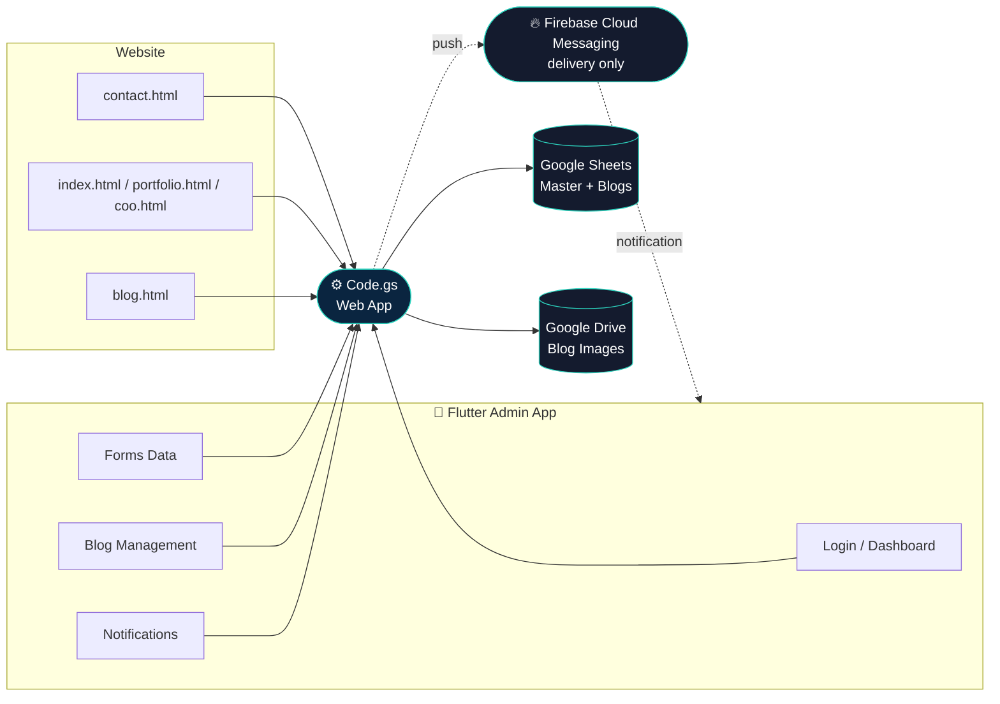

<div align="center">


<a href="https://github.com">
  
</a>

<br/>


</div>

## 📖 What this is

A complete personal admin system built entirely on **Google Apps Script +
Google Sheets + Google Drive** — no traditional server, no external
database. It has three parts that all talk to the same backend:

| Part | What it does |
|---|---|
| 🌐 **Website** | 4 contact-form pages (`contact.html`, `index.html`, `portfolio.html`, `coo.html`) + a fully dynamic blog (`blog.html`) with search, categories, pagination, and a featured post |
| ⚙️ **Backend** | One `Code.gs` file — REST-style API for auth, contact forms, blog CRUD, image upload, notifications, and push delivery |
| 📱 **Mobile App** | A Flutter admin app — Login, Dashboard, Forms Data, Blog Management, Notifications (with real push), and Settings |

<div align="center">

</div>

## ✨ Features

<table>
<tr>
<td width="33%" valign="top">

### 🌐 Website
- 4 contact forms → auto-routed to the right sheet
- Honeypot + rate-limit + duplicate-detection spam protection
- Dynamic blog engine (search, categories, pagination, featured post, related posts)
- Views counter per post
- Dark-mode toggle, responsive design

</td>
<td width="33%" valign="top">

### ⚙️ Backend (`Code.gs`)
- Token-based admin auth (hashed password)
- Contact + blog CRUD, all via one Web App URL
- Image upload straight to Google Drive
- Self-healing setup (`setupProject()`)
- Script-cache layer for faster repeat reads
- Push notifications via FCM (backend-triggered)

</td>
<td width="33%" valign="top">

### 📱 Mobile App
- Dark navy/teal Material 3 theme, Poppins + Inter typography
- Dashboard with live stat cards
- Forms Data: search, filter, star, delete, share
- Blog Management: create/edit/publish, image picker
- Notifications: unread badge + **push even when fully closed**
- Settings: change password, CSV export, logout

</td>
</tr>
</table>

<div align="center">

</div>

## 🏗️ Architecture



> Firebase appears in exactly one place: delivering push notifications.
> Every other part of the system — auth, data, images, blog content — is
> Google Apps Script, Sheets, and Drive.

<div align="center">

</div>

## 📂 Project structure

```
├── website/
│   ├── contact.html
│   ├── index.html
│   ├── portfolio.html
│   ├── coo.html
│   └── blog.html
│
├── backend/
│   └── Code.gs                    # entire Apps Script backend
│
└── mobile_app/                    # Flutter project (personal_admin_app)
    ├── pubspec.yaml
    ├── assets/icon/                # app logo → flutter_launcher_icons
    └── lib/
        ├── main.dart
        ├── theme/app_theme.dart
        ├── models/                 # Contact, Blog
        ├── services/                # api_service, notification_service, push_service
        ├── screens/                 # login, dashboard, forms_data, blog_management,
        │                             # notifications, settings, app_shell...
        └── widgets/                  # contact_card, blog_card, dashboard_card...
```

<div align="center">

</div>

## 🚀 Getting started

Full step-by-step guides (written for zero prior experience) live
alongside this file:

| Guide | Covers |
|---|---|
| `SETUP_GUIDE.md` | Deploying `Code.gs`, connecting the website pages |
| `MOBILE_SETUP_GUIDE.md` | Installing Flutter, running the app, login |
| `PUSH_NOTIFICATIONS_SETUP.md` | Firebase project setup for push delivery |

**Quick version:**

```bash
# 1. Backend
#    Paste Code.gs into script.google.com → run setupProject() once →
#    Deploy as Web App → Who has access: Anyone → copy the /exec URL

# 2. Website
#    Paste the Web App URL + API key into each HTML file's API_CONFIG block

# 3. Mobile app
cd mobile_app
flutter pub get
flutter run
```

Default login (change immediately via `setMyPassword()` in the script
editor): `admin` / `ChangeMe123!`

<div align="center">

</div>

## 🛠️ Tech stack

<div align="center">


-FFCA28?style=flat-square&logo=firebase&logoColor=black)


</div>

<div align="center">

</div>
